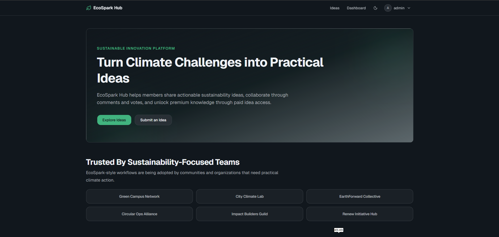
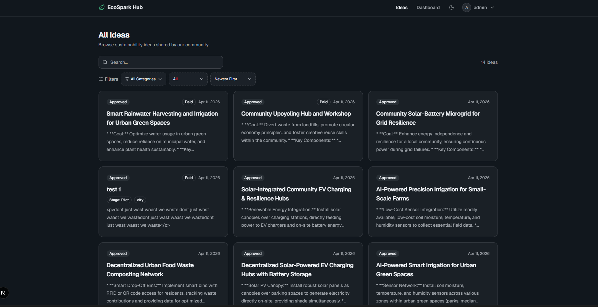
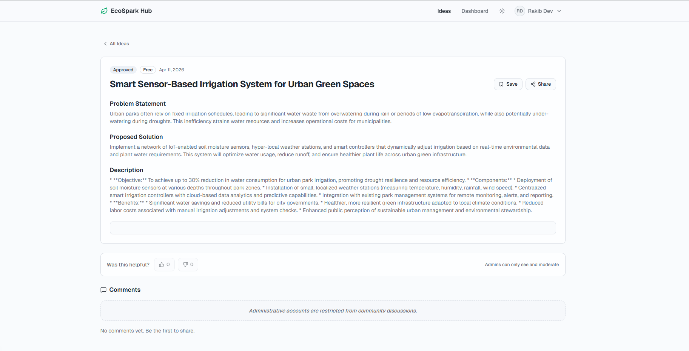
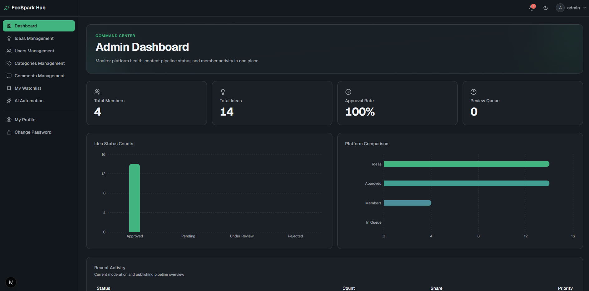

# EcoSpark Hub 🌿

EcoSpark Hub is a premium sustainability platform designed to turn climate challenges into actionable, community-driven projects. Built with a modern tech stack (Next.js, Node.js, Prisma, Stripe), it enables users to share green ideas, collaborate, and unlock premium knowledge.

## ✨ Key Features

- **🤖 AI-Powered Automation**: Daily automatic generation of 3 unique sustainability ideas using Google Gemini AI, ensuring the platform stays fresh and inspiring.
- **💳 Premium Content Monetization**: Integrated Stripe payments for "Paid Ideas," allowing authors to monetize high-value sustainability blueprints.
- **📊 Advanced Dashboards**: 
  - **Admin**: Monitor platform health, manage users, and review idea submissions with interactive charts.
  - **Member**: Track submitted ideas, manage personal profiles, and view unlocked content.
- **🗳️ Community Engagement**: Voting, commenting, and practical user reviews for every project.
- **🔍 Smart Search & Filtering**: Instant, server-managed search with advanced filters for location, category, and implementation stage.
- **🎨 Premium UI/UX**: Fully responsive, dark-mode supported interface with elegant "Beam" animations and optimized skeleton loaders.

## 🛠️ Tech Stack

### Frontend
- **Framework**: Next.js 15 (App Router)
- **Styling**: Tailwind CSS, Shadcn UI
- **State Management**: TanStack Query (React Query)
- **Animations**: Framer Motion
- **Icons**: Lucide React

### Backend
- **Runtime**: Node.js (TypeScript)
- **Framework**: Express.js
- **Database**: PostgreSQL with Prisma ORM
- **Authentication**: Better Auth
- **Payments**: Stripe API
- **AI Integration**: Google Gemini AI

---

## 📸 Screenshots

### User Experience
| Idea Exploration | Idea Details |
| :---: | :---: |
|  |  |

### Dashboards
| Admin Dashboard | User Dashboard |
| :---: | :---: |
|  |  |

### Management & Profile
| User Management | My Profile |
| :---: | :---: |
|  |  |

---

## 🚀 Getting Started

The project is divided into two main parts:

1.  **[Frontend](./eco-spark-frontend)**: The Next.js client application.
2.  **[Backend](./eco-spark-backend)**: The Express.js API server.

### Prerequisites
- Node.js 20+
- PostgreSQL
- Stripe Account
- Google Gemini API Key
- Cloudinary Account

### Quick Setup
1. Clone the repository.
2. Follow the setup instructions in the `/eco-spark-backend` and `/eco-spark-frontend` folders.

---

## 📜 License
This project is licensed under the MIT License.
