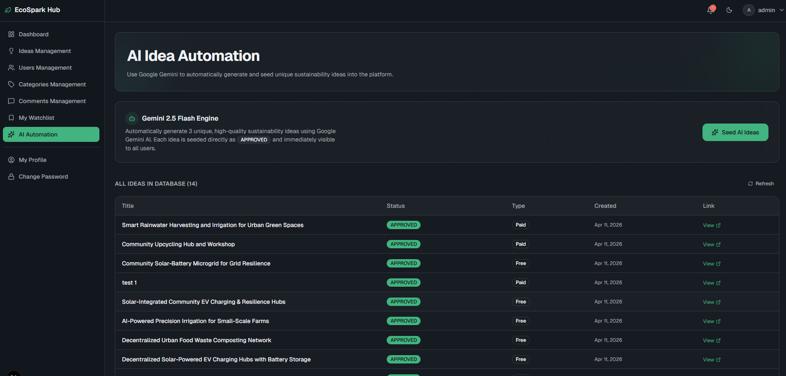

# EcoSpark Hub - Backend API ⚙️

The robust Node.js/TypeScript engine powering the EcoSpark Hub platform. It handles authentication, data management, AI automation, and payment processing.



## 🚀 Getting Started

### 1. Installation
Navigate to the backend directory and install dependencies:
```bash
cd eco-spark-backend
npm install
```

### 2. Environment Setup
Create a `.env` file based on `.env.example`:
```bash
cp .env.example .env
```
Fill in the required keys:
- **Database**: `DATABASE_URL` (PostgreSQL)
- **Authentication**: `ACCESS_TOKEN_SECRET`, `REFRESH_TOKEN_SECRET`, `BETTER_AUTH_SECRET`
- **AI Integration**: `GEMINI_API_KEY` (Get from Google AI Studio)
- **Payments**: `STRIPE_SECRET_KEY`, `STRIPE_WEBHOOK_SECRET`
- **Storage**: `CLOUDINARY_*` keys for image uploads.
- **Automation**: `AUTOMATION_SECRET` (Secure key for external cron pings)

### 3. Database Migration
```bash
npx prisma migrate dev
```

### 4. Running the Server
```bash
# Development mode
npm run dev

# Build and Start
npm run build
npm start
```

---

## 🏗️ Architecture & Features

### AI Automation
The system uses **Google Gemini AI** to generate 3 unique sustainability projects every day.
- **Cron Job**: Internal `node-cron` scheduled for `00:00`.
- **Webhook**: `POST /api/v1/ideas/trigger-automation` allows external services (like cron-job.org) to trigger the task on platforms like Render Free Tier.

### Security
- **Better Auth**: Comprehensive authentication system with Google OAuth support.
- **Role-Based Access**: Granular control for `ADMIN` and `MEMBER` roles.
- **Administrative Protection**: Safety rules preventing admins from being demoted to members.

### Payments
- **Stripe Integration**: Secure checkout sessions for purchasing premium idea access.
- **Webhooks**: Automatic fulfillment of idea access upon successful payment.

---

## 🛠️ Tech Stack Details
- **Framework**: Express.js
- **ORM**: Prisma
- **Validation**: Zod
- **Image Handling**: Multer + Cloudinary
- **Scheduling**: Node-Cron
