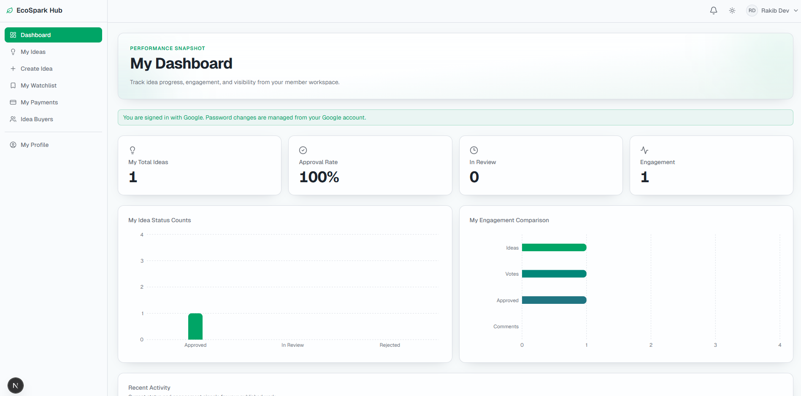
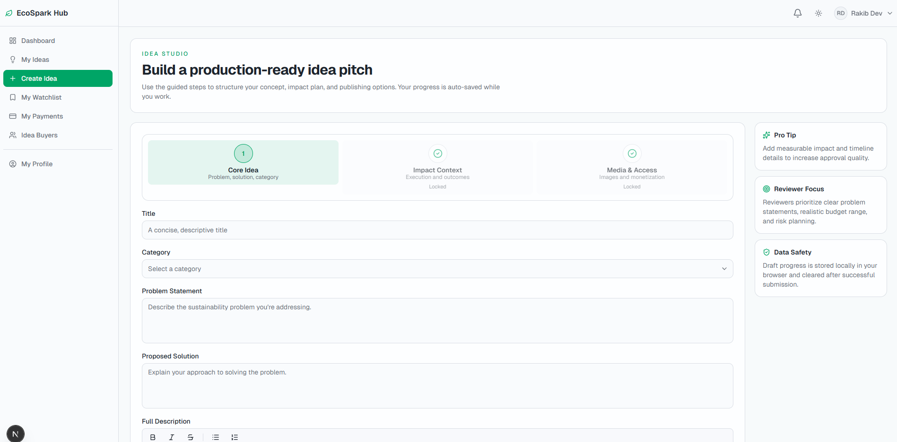
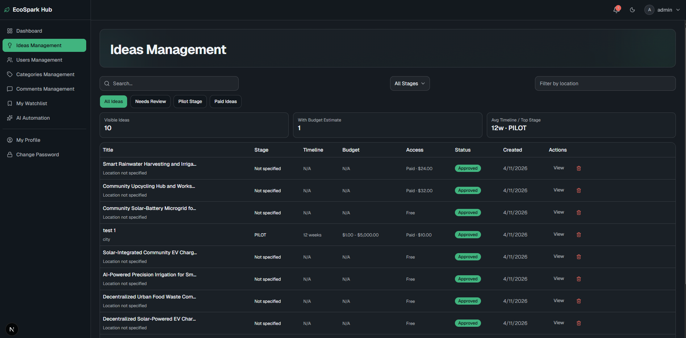
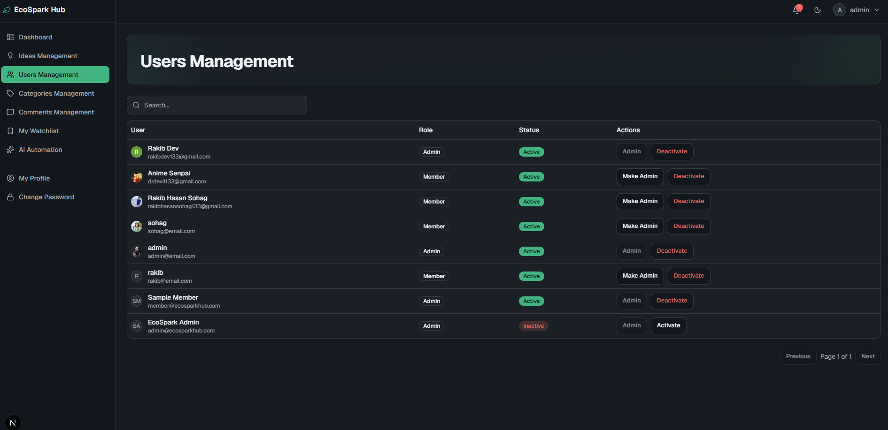
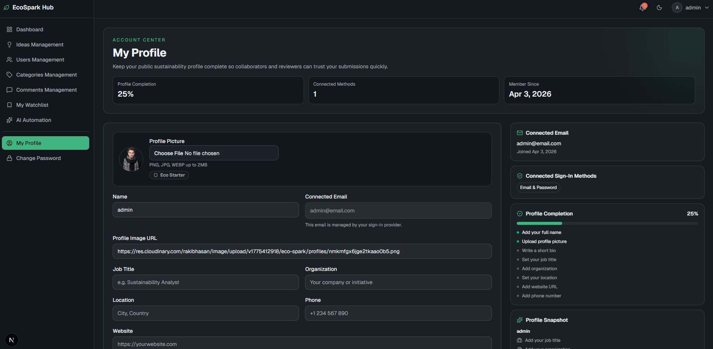

# EcoSpark Hub - Frontend Application 🎨

A premium, interactive user interface built with Next.js 15, designed to provide a seamless experience for sustainability enthusiasts and administrators.



## 🚀 Getting Started

### 1. Installation
Navigate to the frontend directory and install dependencies:
```bash
cd eco-spark-frontend
npm install
```

### 2. Environment Setup
Create a `.env.local` file:
```bash
NEXT_PUBLIC_API_BASE_URL=http://localhost:5000/api/v1
```

### 3. Running the App
```bash
# Development mode
npm run dev

# Build and Start
npm run build
npm start
```

---

## ✨ UI/UX Highlights

### 💎 Premium Design
- **Beam Animations**: Custom-built interactive cards with sliding light effects (`BeamHoverCard`).
- **Smooth Transitions**: Integrated `Framer Motion` for page and section transitions.
- **Dynamic Skeletons**: Hand-crafted loading states that match the final page structure exactly, including "beam" effects.

### 🌓 Theme Support
- Full **Dark Mode** and **Light Mode** support using `next-themes`.
- Accessible color palette derived from Radix UI colors.

### 🛠️ Interactive Management
- **Server-Managed Data Tables**: High-performance tables with debounced search, filtering, and pagination.
- **Admin Command Center**: Specialized management views for ideas and user accounts.
- **Idea Creation**: Multi-step forms with image upload and rich text editing.

---

## 🏗️ Technical Architecture

### Core Technologies
- **Next.js 15**: Leveraging App Router, Server Components, and Server Actions.
- **TanStack Query**: Robust caching and synchronization for API data.
- **Shadcn UI**: Modern, accessible component library based on Tailwind CSS.
- **Lucide React**: Beautiful, consistent iconography.

---

## 📸 Component Gallery

| Idea Creation | Admin Idea Management |
| :---: | :---: |
|  |  |

| Users Management | My Profile |
| :---: | :---: |
|  |  |
